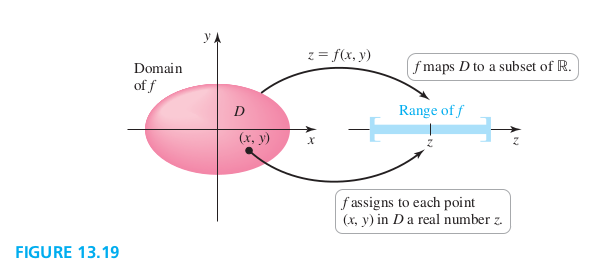
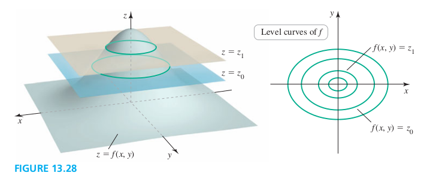

### Section 13.2 Graphs and Level Curves

#### Functions of Two Variables
In general, functions of two variables are written explicitly in the form
$$
\begin{aligned}
z =f(x, y)
\end{aligned}
$$
or in the form
$$
\begin{aligned}
F(x, y, z) = 0
\end{aligned}
$$

##### Function, Domain, and Range with Two Independent Variables
A **function** $z = f(x, y)$ assigns to each point $(x, y)$ in a set D in $\R^2$ a unique real number $z$ in a subset of $\R^2$. The set $D$ is the **domain** of $f$. The **range** of $f$ is the set of real numbers $z$ that are assumed as the points $(x, y)$ vary over the domain (Figure 13.19).

#### Graphs of Functions of Two Variables

##### Examples
1\. **Graphing two-variable functions** Find the domain and range of the following functions. Then sketch a graph.
a. $f(x, y) = 2x + 3y - 12$ &emsp; b. $g(x, y) = x^2 + y^2$
c. $h(x, y) = \sqrt{1 + x^2 + y^2}$
>Solution
Todo

##### Level Curves

