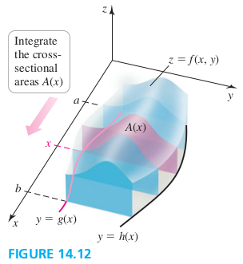

### Section 14.2 Double Integrals Over General Regions

#### General Regions of Integration

#### Iterated Integrals
Assume for the moment that $f$ is nonnegative on $R$ and consider the solid bounded by the surface $z=f(x, y)$, and $R$. Imagine taking vertical slices throught he solid parallel to the y-axis. The cross section througnthe solid at a fixed value of $x$ extends from the lower curver $y=g(x)$ to the upper curver $y=h(x)$. The area of that cross section is
$$
\begin{aligned}
A(x) = \int_{g(x)}^{h(x)} f(x, y) dy \quad (a \les x \les y)
\end{aligned}
$$
The volume of the region is given by a double integral; it is evaluated by integrating the cross-sectional areas $A(x)$ from $x=a$ to $x=b$
$$
\begin{aligned}
\iint\limits_R f(x, y) dA = \int_a^b \blue{\underbrace{\int_{g(x)}^{h(x)} f(x, y) dy}_{A(x)}} dx
\end{aligned}
$$

##### EXAMPLE 1 Evaluating a double integral
Express the integral $\d\iint\limits_R f(x, y) dA$ as an iterated integral, where $R$ is the region bounded by the parabolas $y=3x^2$ and $y=16-x^2$. Then evaluated the integral.
>Solution
$$
\begin{aligned}
\iint\limits_R f(x, y) dA &= \int_{-2}^2 \int_{3x^2}^{16-x^2}2x^2y dy dx\\
&= \int_{-2}^2 (-8x^6-32x^4 + 256x^2) dx
\end{aligned}
$$
