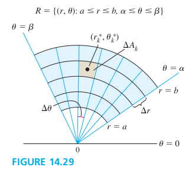
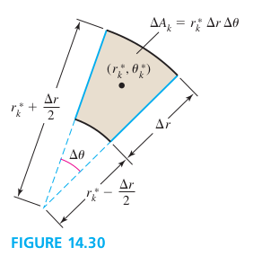
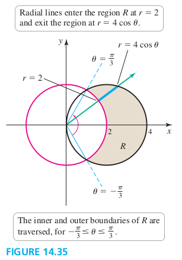

### Section 14.3 Double Integrals in Polar Coordinates

#### Polar Rectangular Regions

Figure 14.30 shows the *k*th rectangular, with area of $\Delta A_k$. The point $(r_k^*, \th_k^*)$ is chosen so that the outer arc of the polar rectangle has radius $r_k^* + \Delta r /2$, and the inner arc has the radius $r_k^* - \Delta r /2$. The area of the polar rectangle is
$$
\begin{aligned}
\Delta A_k &= (\text{area of outer sector}) - (\text{area of inner sector})\\
&=\frac{1}{2}(r_k^* + \frac{\Delta r}{2})^2 \Delta \th - \frac{1}{2}(r_k^* - \frac{\Delta r}{2})^2 \Delta \th\\
&= r_k^* \Delta r \Delta \th
\end{aligned}
$$

##### Double Integrals over Polar Rectangular Regions
Let $f$ be continuous on the region in the xy-plane $R=\{(r, \th): 0 \les a \les r \les b, \alpha \les \th \les \beta\}$, where $\beta - \alpha \les 2\pi$. Then
$$
\begin{aligned}
\iint\limits_R f(r, \th) dA = \int_{\alpha}^{\beta} \int_a^b f(r, \th) r dr d\th
\end{aligned}
$$

##### EXAMPLE 1 Volumes of a paraboloid-cap
Find the volume of the solid bounded by the paraboloid $z=9-x^2-y^2$ and the xy-plane.
>Solution
$V = \dint_0^{2\pi} \int_0^3 (9-r^2)r dr d\th = \frac{81\pi}{2}$

##### EXAMPLE 2 Region bounded by two surfaces
Find the volume of the region bounded by the paraboloids $z = x^2 + y^2$ and $z = 8 - x^2 - y^2$. This problem was solved in rectangular coordinates in Example 5 of Section 14.2.
>Solution
$$
\begin{aligned}
R &= \{(r, \th): 0 \les r \les 2, 0 \les \th \les 2\pi\}\\
V &= \dint_0^{2\pi} \int_0^2 \bigg((8-r^2) - r^2 \bigg)r dr d\th \\
&= 16\pi
\end{aligned}
$$

##### EXAMPLE 3 Annular Region
Find the volume of the region beneath the surface $z = xy + 10$ and above the annular region $R = \{(r, \th): 0 \les r \les 2, 0 \les \th \les 2\pi\}$. (An annulus is the region between two concentric circles.)
>Solution
$$
\begin{aligned}
xy + 10 &= r\sin\th r\cos \th + 10\\
&= \frac{1}{2}r^2 \sin 2\th + 10\\
V &= \dint_0^{2\pi} \int_2^4 \bigg(\frac{1}{2}r^2 \sin 2\th + 10 \bigg)r dr d\th \\
&= 120\pi
\end{aligned}
$$

#### More Generak Polar Regions

##### Double Integrals over Polar Rectangular Regions
Let $f$ be continuous on the region in the xy-plane
$$
R=\{(r, \th): 0 \les g(\th) \les r \les h(\th), \alpha \les \th \les \beta\}
$$
where $0 < \beta - \alpha \les 2\pi$. Then
$$
\iint\limits_R f(r, \th) dA = \int_{\alpha}^{\beta} \int_{g(\th)}^{h(\th)} f(r, \th) r dr d\th
$$

##### EXAMPLE 4 Specifying regions
Write an iterated integral for $\d\iint\limits_R f(r, \th) dA$ for the following regions R in the xy-plane.
a. The region outside the circle $r=2$ (with radius 2 centered at (0, 0)) and inside the circle $r=4\cos\th$ (with radius 2 centered at (2, 0))
b. The region inside both circle of part (a)

>Solution
a. Equating the two expression for $r$.
$$
\begin{aligned}
\iint\limits_R f(r, \th) dA = \int_{-\pi/3}^{\pi/3} \int_{2}^{4\cos \th} f(r, \th) r dr d\th
\end{aligned}
$$
b. The region $R$ consists of three subregion $R_1, R_2$, and $R_3$
$$
\begin{aligned}
\iint\limits_R f(r, \th) dA &= \int_{-\pi/2}^{-\pi/3} \int_{0}^{4\cos \th} f(r, \th) r dr d\th + \int_{-\pi/3}^{\pi/3} \int_{0}^{2} f(r, \th) r dr d\th\\
&+ \int_{\pi/2}^{\pi/3} \int_{0}^{4\cos \th} f(r, \th) r dr d\th
\end{aligned}
$$

#### Areas of Regions

##### Area of Polar Regions
The region of the area $R=\{(r, \th): 0 \les g(\th) \les r \les h(\th), \alpha \les \th \les \beta\}$, where $0 < \beta - \alpha \les 2\pi$, is
$$
A = \iint\limits_R dA = \int_{\alpha}^{\beta} \int_{g(\th)}^{h(\th)} r dr d\th
$$

##### EXAMPLE 5 Area within a lemniscate
Compute the area of the region in the first and fourth quadrants outside the circle $r = \sqrt 2$ and inside the lemniscate $r^2 = 4 \cos 2\th$.
>Solution
$$
\begin{aligned}
A &= \int_{-\pi/6}^{\pi/6} \int_{\sqrt 2}^{2\sqrt {\cos 2\th}} r dr d\th\\
&= \sqrt 3 - \frac{\pi}{3}
\end{aligned}
$$

#### Average Value over a Planar Polar Region
To find the average value of a function over a region in polar coordinates, we again integrate the function over ther egion and divided by the area of the region.

##### EXAMPLE 6 Average y-coordinate
Find the average value of the y-coordinates of the points in the semicircular disk of radius a given by $R=\{(r, \th): 0 \les r \les a, 0 \les \th \les \pi\}$.
>Solution
$$
\begin{aligned}
\bar{y} &= \frac{2}{\pi a^2} \int_{0}^{\pi} \int_{0}^{a} r\sin \th \space r dr d\th\\
&= \frac{4a}{3\pi}
\end{aligned}
$$
