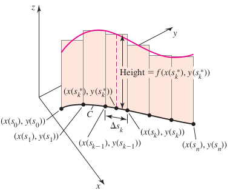

### Section 15.2 Line Integrals

#### Scalar Line Integrals in the Plane
Suppose the scalar-valued function $f$ is defined on the smooth curve $C:r(s) = \la x(s), y(s) \ra$, parameterized by the arc length $s$. The line integral of $f$ over $C$ is
$$
\begin{aligned}
\int_C f(x(s), y(s)) ds = \lim_{\Delta \to 0} \sum_{k=1}^b f(x(s_k^*), y(s_k^*))
\end{aligned}
$$
provided this limit exists over all partitions of $C$. When the limit exists, $f$ is said to be integrable on $C$.

##### EXAMPLE 1 Average temperature on a circle
The temperature of the circular plate $R = \{ (x, y): x^2 + y^2 \les 1\}$ is $T(x, y) = 100(x^2 + 2y^2)$. Find the average temperature along the edge of the plate.
>Solution
Calculating the average value required integrating the temperature function over the boundary circle $C = \{ (x, y): x^2 + y^2 = 1\}$ and dividing by the length (circumference) of $C$.
$$
\begin{aligned}
\int_C T(x, y)ds = 300 \pi
\end{aligned}
$$

##### Evaluating Scalar Line Integrals in $\R^2$
Left f be continuous on a region containing a smooth curve $C:r(t) = \la x(t), y(t) \ra$, for $a \les x \les b$. Then
$$
\begin{aligned}
\int_C fs &= \int_a^v f(x(t), y(t)) |r'(t)| dt\\
&= \int_a^v f(x(t), y(t)) \sqrt{x'(t)^2 + y'(t)^2} dt
\end{aligned}
$$

#### Line Integrals in $\R^3$

##### EXAMPLE 3 Line integrals in $\R^3$
Evaluate $\dint_C (xy + 2z) ds$ on the following segments.
a. The line sements from $P(1, 0, 0)$ to $Q(0, 1, 1)$.
b. The line sements from $Q(0, 1, 1)$ to $P(1, 0, 0)$.
>Solution
Both a and b yield the same result $\frac{7\sqrt 3}{6}$. A scalar line integral is independent of the orientation and parameterization of the curve.

##### EXAMPLE 4 Flight of an eagle
An eagle soars on the ascending spiral path $C: r(t) = \la x(t), y(t), z(t) \ra = \la 2400\cos \frac{t}{2}, 2400\sin \frac{t}{2}, 500t \ra$, where $x, y$ and $z$ are measured in feet and $t$ is measured in miniutes. How far does the eagle fly over the time interval $0 \les t \les 10$?
>Solution
$13000$ ft.

#### Line Integrals of Vector Fields

##### Work Integrals

#### Circulation and Flux of a Vector Field
