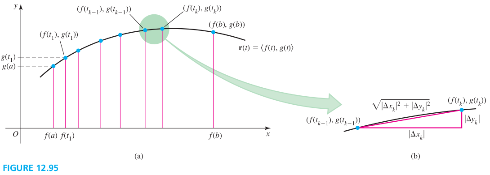

### Section 12.8 Length Of Curvature

#### Arc Length
To find the length of the curve between $(f(a), g(a))$ and $(f(b), g(b))$, we first subdivide the interval $[a,b]$ into $n$ subinterval using the grid points
$$
a = t_0 < t_1 < t_2 < \cdots t_n = b
$$
We connect the corresponding points into curves,
$$
(f(t_0), g(t_0)), \cdots f(t_k), g(t_k), \cdots f(t_n), g(t_n)
$$

#### Arc Length for Vector Functions
Consider the parameterized curve $r(t) = \langle f(t), g(t), h(t) \rangle$, where $f', g'$ and $h'$ are continuous, and the curve is traversed once for $a \les t \les b$. The arc length of the curve between $(f(a), g(a), h(a))$ and $f(b), g(b), h(b)$ is
$$
\begin{aligned}
L = \int_a^b \sqrt{f'(t)^2 + g'(t)^2 + h'(t)^2} dt = \int_a^b |r'(t)| dt
\end{aligned}
$$

#### Arc Length for a Polar Curve
Let $f$ have a continuous derivative on the interval $[\alpha, \beta]$. The arc length of the polar curve $r = f(\th)$ on $[\alpha, \beta]$ is
$$
\begin{aligned}
L = \int_{\alpha}^{\beta} \sqrt{f(\th)^2 + f'(\th)^2} d\th
\end{aligned}
$$

#### Arc length as Function of a Parameter
Let $r(t)$ describe a smooth curve, for $t \ges a$. The arc length is given by
$$
s(t) = \int_a^t |v(u)| du
$$
where $|v| = |r'|$. Equivalently, $\dfrac{ds}{dt} = |v(t)| > 0$. If $|v(t)| = 1$, for $t \ges a$, then the parameter $t$ corresponding to the arc length.

#### Homework
p860: 2, 9-25 odd, 27, 31, 35, 52, 53a,b, 62
