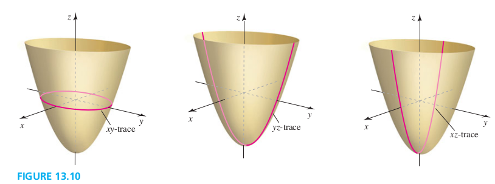

### Section 13.1 Planes and Surfaces

#### Equations of Planes

##### Plane in $\R^3$
Given a fixed Point $P_0$ and a **nonzero normal vector n**, the set of pointsP in $\R^3$ for which $\vec{P_0 P}$ is orthogonal to n is called a **plane**.

##### Genernal Equations of a Plane in $\R^3$
The plane passing through the point $P_0(x_0, y_0, z_0)$ with a nonzero normal vector $n= \langle a, b, c \rangle$ is described by the equation
$$
\begin{aligned}
&a(x-x_0) + b(y-y_0) + c(z-z_0) = 0\\
\end{aligned}
$$
Or
$$
\begin{aligned}
&ax + by + cz = d
\end{aligned}
$$
where $d = ax_0 + by_0  + cz_0$

##### Examples
1\. **Equations of a plane** Find an equation of the plane passing through $P_0(2, -3, 4)$ with a normal vector $n= \langle -1, 2, 3 \rangle$
>Solution
$-x+2y+3z = 4$

2\. **A plane through three points** Find an equation of the plane that passes through the (noncollinear) points $P(2, -1, 3)$, $Q(1, 4, 0)$, and $R(0, -1, 5)$
>Solution
$5x+4y+5z = 21$

3\. **Properties of a plane** Let Q be the plane described by the equation $2x-3y-z = 6$
a. Find a vector normal to Q.
b. Find the points at which Q intersects the coordinate axes and plot Q.
c. Describe the sets of points at which Q intersects the yz-plane, the xz-plane, and the xy-plane.
>Solution
a. $\langle 2, -3, -1 \rangle$
b. x-intercept, $(3, 0, 0)$; y-intercept, $(0, -2, 0)$; z-intercept, $(0, 0, -6)$;
c. Let $x=0$, Q gives $-3y-z=6$m which decribes a line in yz-plane. Similar for xy-plane and xz-plane.

#### Parallel and Orthogonal Planes
Two distinct planes are **parallel** if their respective normal vectors are parallel (that is, the normal vectors are scalar multiples of each other). Two planes are **orthogonal** if their respective normal vectors are orthogonal (that is, the dot product of the normal vectors is zero).

##### Examples
6\. **Intersecting planes** Find an equation of the line of intersection of the planes Q: $x+2y+z=5$ and R: $2x+y-z=7$.
>Solution
$r(t)=\langle 3-3t, 1 + 3t, -3t \rangle$

#### Cylinders and Traces

##### Cylinder
Given a curve C in a plane P and a line / not in P, a cylinder is the surface consisting of all lines parallel to / that pass through C (Figure 13.8).

##### Trace
A trace of a surface is the set of points at which the surface intersects a plane that is parallel to one of the coordinate planes. The traces in the coordinate planes are called the xy-trace, the xz-trace, and the yz-trace (Figure 13.10).

#### Quadric Surfaces
Quadric surfaces are described by the general quadratic (second-degree) equation in three variables,
$$
\begin{aligned}
Ax^2 + By^2 + Cz^2 + Dxy + Eyz + Fxz + Gx + Hy + Iz + J = 0
\end{aligned}
$$

**Table 13.1**
Name | Standard Equation | Features | Graph
-----|-------------------|----------|------
Ellipsoid | $\displaystyle  \frac{x^2}{a^2} + \frac{y^2}{b^2} + \frac{z^2}{c^2} = 1$ | All traces are ellipses | 
Elliptic paraboloid | $\displaystyle z= \frac{x^2}{a^2} + \frac{y^2}{b^2}$ |
Hyperboloid of one sheet | $\displaystyle \frac{x^2}{a^2} + \frac{y^2}{b^2} - \frac{z^2}{c^2} = 1$ |
Hyperboloid of two sheets | $\displaystyle \frac{x^2}{a^2} - \frac{y^2}{b^2} + \frac{z^2}{c^2} = 1$ |
Elliptic cone | $\displaystyle \frac{x^2}{a^2} + \frac{y^2}{b^2} = \frac{z^2}{c^2}$ |
Hyperbolic paraboloid | $\displaystyle z= \frac{x^2}{a^2} - \frac{y^2}{b^2}$ |
