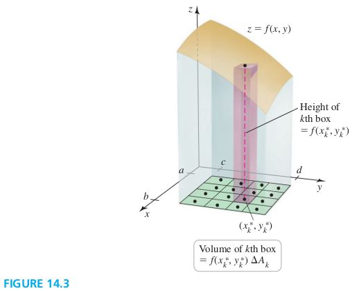

### Section 14.1 Double Integrals Over Rectangular Regions

#### Volumes Of Solids
A function $f$ defined on a rectangle region $R$ in the xy-plane is **integrable** on $R$ if $\dlim_{\Delta \to 0} \sum_{k=1}^n f(x_k^*, y_k^*) \Delta A_k$ exists for all partitions of $R$ and for all choice of $(x_k^*, y_k^*)$ within those partitions. The limit is the **double integral** of $f$ over $R$, which we write
$$
\begin{aligned}
\iint\limits_R f(x, y) dA = \lim_{\Delta \to 0} \sum_{k=1}^n f(x_k^*, y_k^*) \Delta A_k
\end{aligned}
$$
If $f$ is nonnegative on $R$, then the double integral equals the volume of the solid bounded by $z = f(x, y)$ and the xy-plane over $R$.

#### Iterated Integrals
We first evaluate the inner integral with respect to $y$ holding $x$ fixed; the result is a function of $x$. THen the outer integral is evaluated with respect to $x$; the result is a real number, which is the volume of the solid. BOth these integrala are ordinary one-variable integrals.

##### EXAMPLE 1 Evaluating an iterated integral
Evalute $V = \dint_0^1 A(x) dx$, where $A(x) = \dint_0^2 (6-2x-y) dy$
>Solution
$A(x) = 10-4x$, and $V = 8$

##### Double Integrals on Rectangular Regions
Let $f$ be continuous on the rectangular region $R = \{(x, y): a\les x \les b, c\les y \les d\}$. The double integral of $f$ over $R$ may be evaluated by either of two iterated
integrals:
$$
\begin{aligned}
\iint\limits_R f(x, y) dA = \int_c^d \int_a^b f(x, y) dx dy = \int_a^b \int_c^d f(x, y) dy dx
\end{aligned}
$$

##### EXAMPLE 3 A Double integral
FInd the volume of the solid bounde dby the surface $z=4 + 9x^2y^2$ over the region $R = \{(x, y): -1\les x \les 1, 0\les y \les 2\}$. Use both possible orders of integration.
>Solution
$32$

##### EXAMPLE 4 Choosing a conveninet order of integration
Evaluate $\d\iint\limits_R ye^{xy} dA$, where $R = \{(x, y): 0\les x \les 1, 0\les y \les \ln 2\}$.
>Solution
$1-\ln 2$

#### Average Value
The average value of an integrable function $f$ over a region $R$ is
$$
\begin{aligned}
\bar{f} = \frac{1}{\text{area of } R} \iint \limits_R f(x, y) dA
\end{aligned}
$$

##### EXAMPLE 5 Average value
Find the average value of the quantity $2-x-y$ over the square $R = \{(x, y): 0\les x \les 2, 0\les y \les \ln 2\}$.
>Solution
$\bar{f} = 0$
